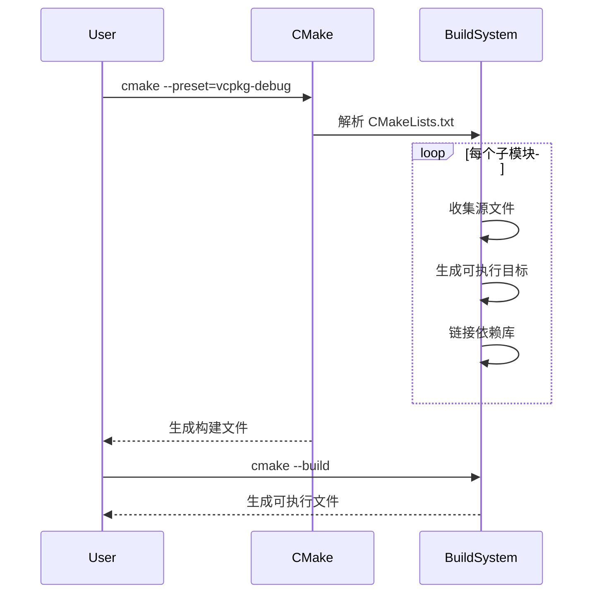

# C++ 常用库学习项目

## 项目结构
```
├── CMakeLists.txt
├── vcpkg.json
└── src/
    ├── Learning[库名]/       # 例如 LearningSpdLog
    │   ├── CMakeLists.txt    # 子模块配置
    │   └── src/*.cpp         # 测试代码
    └── ...
```

---

## 快速替换库模板
### 子模块 CMakeLists.txt 配置
```cmake
# 1. 声明依赖（替换示例）
find_package(库名 [版本] REQUIRED)  # 例如 nlohmann_json 3.11.2

# 2. 获取当前模块名（自动识别目录名）
get_filename_component(MODULE_NAME ${CMAKE_CURRENT_SOURCE_DIR} NAME)

# 3. 自动编译所有.cpp文件
file(GLOB TEST_SOURCES src/*.cpp)
foreach(test_source ${TEST_SOURCES})
    get_filename_component(test_name ${test_source} NAME_WE)
    
    # 创建可执行文件
    add_executable(${test_name} ${test_source})
    # 自动为每个模块创建独立输出目录
    setup_module_outputs(${test_name})  # 关键调用
    # 4. 链接库（替换为库的目标名称）
    target_link_libraries(${test_name} PRIVATE 
        库名::库名             # 例如 nlohmann_json::nlohmann_json
    )
    
    # 5. 库特定编译定义（可选）
    target_compile_definitions(${test_name} PRIVATE
        库前缀_配置宏=值      # 例如 JSON_USE_IMPLICIT_CONVERSIONS=1
    )
    
    # 6. IDE分组（自动使用模块名,可选）
    set_property(TARGET ${test_name} PROPERTY FOLDER ${MODULE_NAME})
endforeach()

# 7. 编译器检查（可选）
if(CMAKE_CXX_COMPILER_ID MATCHES "GNU|Clang")
    target_compile_options(${test_name} PRIVATE -Wall -Wextra)
endif()
```

---

## 子模块 CMakeLists.txt 逐行解析
| 代码片段 | 功能说明 | 关键参数解析 |
|---------|---------|-------------|
| `find_package(库名 REQUIRED)` | 查找并加载库配置 | `REQUIRED`：未找到则报错 |
| `get_filename_component(MODULE_NAME ...)` | 提取目录名作为模块名 | `NAME`：获取路径末段 |
| `file(GLOB TEST_SOURCES ...)` | 收集所有 `.cpp` 文件 | `src/*.cpp`：匹配规则 |
| `add_executable(${test_name} ...)` | 定义可执行目标 | `${test_name}`：无后缀文件名 |
| `target_link_libraries(...)` | 链接库 | `PRIVATE`：仅当前目标使用 |
| `target_compile_definitions(...)` | 添加预定义宏 | 控制库的特定功能开关 |
| `set_property(FOLDER ...)` | IDE分组管理 | `${MODULE_NAME}`：动态分组名 |

---

## 常用库配置速查表
| 库名           | find_package                  | target_link_libraries       | 典型编译定义                  |
|----------------|-------------------------------|----------------------------|-----------------------------|
| spdlog         | `find_package(spdlog)`        | `spdlog::spdlog`           | `SPDLOG_ACTIVE_LEVEL=...`   |
| nlohmann_json  | `find_package(nlohmann_json)` | `nlohmann_json::nlohmann_json` | `JSON_USE_IMPLICIT_CONVERSIONS=1` |
| fmt            | `find_package(fmt)`           | `fmt::fmt`                 | `FMT_USE_XXX=1`             |
| Eigen3         | `find_package(Eigen3)`        | `Eigen3::Eigen`            | 无                          |

---

## 构建流程示意图


---

## 构建步骤
1. **安装依赖**
   ```bash
   vcpkg install 库名 --triplet=[x64-windows|x64-linux|arm64-windows]
   ```

2. **构建项目**
   - **CLion/VSCode**：自动识别 `CMakePresets.json`
   - **手动构建**：
     ```bash
     cmake -B build --preset=vcpkg-debug
     cmake --build build
     ```

---

## 输出目录结构
```
build/
└── bin/
    ├── LearningSpdLog/
    │   ├── test_async.exe
    │   └── test_sinks.exe
    └── LearningJson/
        └── test_basic.exe
```

---

## 最佳实践
1. **版本控制**  
   在 `.gitignore` 中添加：
   ```bash
   /build/
   *.log
   ```

2. **添加新库**
   ```bash
   # 1. 创建模块目录
   mkdir src/Learning[NewLib]
   
   # 2. 复制模板
   cp src/LearningSpdLog/CMakeLists.txt src/Learning[NewLib]/
   
   # 3. 修改库配置（参考速查表）
   ```

3. **IDE 优化**
   - **CLion**：启用 `File > Reload CMake Project` 应用变更
   - **VS Code**：安装 [CMake Tools 扩展](https://marketplace.visualstudio.com/items?itemName=ms-vscode.cmake-tools)

---

